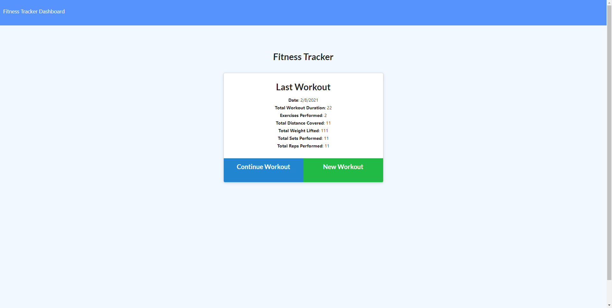

## Employee Roster

#### **Table of Contents**

---

1. [Installalation](#installation)
1. [Trials](#trials)
1. [Usage](#usage)
1. [Credits](#credits)
1. [License](#license)

#### **Installation**

---

To intall this application using prebuilt html and css elements involved this:

1. Install the npm dependencies.
1. Type npm run seed.
1. Type node server.js.

#### **Trials**

---
The front end was provided and doesn't seem to work quite the way I would like it too.

Learning how to optimize the mongoose queries was a fun dip into documentation.

#### **Usage**

---

To start a exercise click "Add Exercise" on the root directory and enter the information in the form.  If you wish to continue that exercise click "Continue Exercise", if not, then click "End Exercise".  There are two links in the top left: "Fitness Tracker" and "Dashboard".  Fitness Tracker will send you back to the base route, and Dashboard will give you the stats of your past seven workouts.

Link to the deployed website can be found [here](https://murmuring-waters-52428.herokuapp.com/).

Link to the GitHub repository is [here](https://github.com/jerler1/Workout-Tracker).

#### **Credits**

---

Thanks to Pete, Tony, Spencer, Jeana-Rose, and Kyle.

#### **License**

---

Copyright (c) 2005-2020 David Heinemeier Hansson

Permission is hereby granted, free of charge, to any person obtaining
a copy of this software and associated documentation files (the
"Software"), to deal in the Software without restriction, including
without limitation the rights to use, copy, modify, merge, publish,
distribute, sublicense, and/or sell copies of the Software, and to
permit persons to whom the Software is furnished to do so, subject to
the following conditions:

The above copyright notice and this permission notice shall be
included in all copies or substantial portions of the Software.

THE SOFTWARE IS PROVIDED "AS IS", WITHOUT WARRANTY OF ANY KIND,
EXPRESS OR IMPLIED, INCLUDING BUT NOT LIMITED TO THE WARRANTIES OF
MERCHANTABILITY, FITNESS FOR A PARTICULAR PURPOSE AND
NONINFRINGEMENT. IN NO EVENT SHALL THE AUTHORS OR COPYRIGHT HOLDERS BE
LIABLE FOR ANY CLAIM, DAMAGES OR OTHER LIABILITY, WHETHER IN AN ACTION
OF CONTRACT, TORT OR OTHERWISE, ARISING FROM, OUT OF OR IN CONNECTION
WITH THE SOFTWARE OR THE USE OR OTHER DEALINGS IN THE SOFTWARE.
